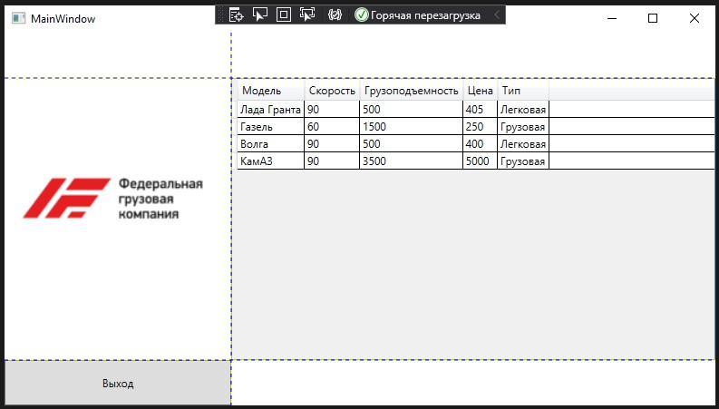

<table style="width: 100%;">
  <tr>
    <td style="text-align: center; border: none;">
    Министерство образования и науки РФ<br>
Государственное бюджетное профессиональное образовательное учреждение Республики Марий Эл<br>
Йошкар-Олинский технологический колледж
</td>
  </tr>
  <tr>
    <td style="text-align: center; border: none; height: 15em;">
    <h2 style="font-size:3em;">Отчет</h2>
      <h3>по лабораторной работе<br><br> по дисциплине "Основы алгоритмизации и программирования"<br><br> Тема:<b> "Каркас приложения. Модель данных. Привязка данных. Табличный вывод."<b> </h3></td>
  </tr>
  <tr>
    <br><br><td style="text-align: right; border: none; height: 20em;">
      Разработал:<br/>
      Пермякова Светлана<br>
      Группа: И-21<br>
      Преподаватель:<br>
      Колесников Евгений Иванович
    </td>
  </tr>
  <tr>
    <td style="text-align: center; border: none; height: 5em;">
    г.Йошкар-Ола,<br> 2021</td>
  </tr>
</table>

<div style="page-break-after: always;"></div>

# Цели и задачи:

Используя материалы лекции Каркас приложения. Модель данных. Привязка данных. Табличный вывод. и классы из предыдущих лабораторных работ разработать WPF-приложение. Логотип подставить свой, соответствующий вашей предметной области.
 # Краткий материал.

* Атрибут *CanUserAddRows="False"* запрещает элементу **DataGrid** добавлять строки с таблицу

* Атриут *AutoGenerateColumns="False"* запрещает автоматическое формирование столбцов таблицы - мы вручную описываем те столбцы, которые хотим видеть.

* Атрибут *ItemsSource="{Binding CatList}"* "привязывает" к таблице источник данных - наш список кошек. 

* В колонках таблицы мы уже "привязываемся" к свойствам класса источника данных# Что же я делал?

# Что же делал?  

Используя материалы лекции Каркас приложения. Модель данных. Привязка данных. Табличный вывод. и классы из предыдущих лабораторных работ разработал WPF-приложение. Логотип подставил свой, соответствующий вашей предметной области.
     
    ```
    <Window x:Class="WpfLabBat.MainWindow"
        xmlns="http://schemas.microsoft.com/winfx/2006/xaml/presentation"
        xmlns:x="http://schemas.microsoft.com/winfx/2006/xaml"
        xmlns:d="http://schemas.microsoft.com/expression/blend/2008"
        xmlns:mc="http://schemas.openxmlformats.org/markup-compatibility/2006"
        xmlns:local="clr-namespace:WpfLabBat"
        mc:Ignorable="d"
        Title="MainWindow" Height="450" Width="800">
    <Grid ShowGridLines="True">
        <Grid.RowDefinitions>
            <RowDefinition Height="50"></RowDefinition>
            <RowDefinition></RowDefinition>
            <RowDefinition Height="50"></RowDefinition>
        </Grid.RowDefinitions>
        <Grid.ColumnDefinitions>
            <ColumnDefinition Width="250"></ColumnDefinition>
            <ColumnDefinition></ColumnDefinition>
        </Grid.ColumnDefinitions>
        <StackPanel VerticalAlignment="Bottom" Grid.RowSpan="3">
            <Button Content="Выход" Height="50"/>
        </StackPanel>
            <DataGrid
    Grid.Row="1"
    Grid.Column="1"
    CanUserAddRows="False"
    AutoGenerateColumns="False"
    ItemsSource="{Binding CarList}">
            <DataGrid.Columns>
                <DataGridTextColumn
            Header="Модель"
            Binding="{Binding Name}"/>
                <DataGridTextColumn
            Header="Скорость"
            Binding="{Binding Speed}"/>
                <DataGridTextColumn
            Header="Грузоподъемность"
            Binding="{Binding LiftingCapacity}"/>
                <DataGridTextColumn
            Header="Цена"
            Binding="{Binding Cena}"/>
            <DataGridTextColumn
            Header="Тип"
            Binding="{Binding Legko}"/>
            </DataGrid.Columns>
         </DataGrid><Image Source="/Photo/Логотип_ФГК.png" Grid.RowSpan="2"/>

    </Grid>
</Window>



